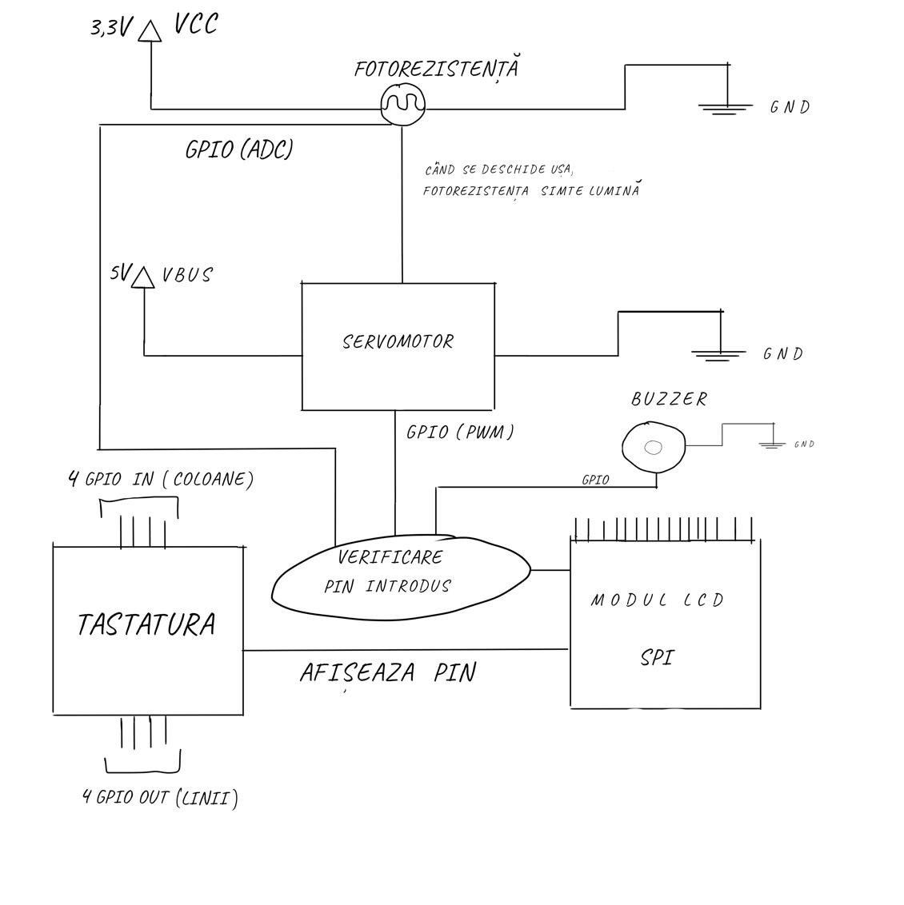

# Implementarea unui Seif Inteligent cu Raspberry Pi Pico W

Bunurile personale și securitatea lor reprezintă, pentru orice persoană, o grijă. Din acest motiv, dezvoltarea unor sisteme de securitate stabile cu o interfață intuitivă oricărui utilizator este necesară.

În cadrul acestui proiect este dezvoltat un sistem hardware complex îmbinat cu un software stabil, prin care se va realiza o implementare demonstrativă a unui **Seif Inteligent** cu autentificare PIN, mecanism servo și sistem de alarmă.

---

## Cuprins

1. [Context](#context)
2. [Cerințe](#cerinte)

    -[Cerințe funcționale](#cerinte-functionale)

    -[Cerințe non-funcționale](#cerinte-non-functionale)

    -[Scenariu de testare](#scenariu-de-testare)

3. [Componente](#componente)
    
    -[Schema bloc](#schema-bloc)

    -[Descrierea componentelor](#descrierea-componentelor)

4. [Arhitectură](#arhitectura)

    -[Definire arhitectură](#definire-arhitectura)

    -[Schema electrică](#schema-electrica)

# 1. Context

Implementarea unui **sistem de securitate fizică** inovator (seif inteligent) pentru a demosntra integrarea componentelor hardware și software într-un dispozitiv embedded funcțional. Sistemul combină autentificarea prin cod PIN, feedback vizual pe ecran LCD, acționare mecanică prin servomotor și detecție de efracție prin senzor de lumină.

Proiectul ilustrează concepte fundamentale de sisteme embedded: 
  -seiful se deblochează prin introducerea unui cod PIN, folosind un modul cu butoane. 
  -starea sistemului afișată pe un ecran LCD. 
  -mecanismul de deschidere realizat prin un servo motor. 
  -un buzzer pentru semnalizarea tentativelor de acces neautorizat la introducerea repetată a unor coduri greșite. 
  -un senzor de lumină în interior care, dacă starea seifului este de "încuiat" și detectează lumină, declanșează o alarmă.
  
---

# 2. Cerințe

## 2.1. Cerințe funcționale:

  * autentificare și control acces: utilizatorul introduce un cod PIN format din câteva cifre folosind butoanele hardware. Sistemul verifică acest cod cu parola, iar dacă datele corespund, servo motorul descuie seiful.

  * interfața cu utilizatorul: pe ecranul LCD sunt afisate mesaje clare de stare, cum ar fi solicitarea introducerii PIN-ului, confirmarea deblocarii, notificarea unui PIN greșit sau mesaje de alarmă.

  * securitate anti-brute-force: pentru a preveni ghicirea parolei, sistemul numără de cate ori este introdus un cod greșit. Dupa 3 incercari consecutive eșuate, buzzer-ul emite o alarmă pentru a semnala o activitate suspectă.

## 2.2. Cerințe non-funcționale:

  * performață și timp de raspuns: interfața trebuie să reacționeze rapid, fără întârzieri vizibile între apăsarea butoanelor și afișare pe ecran. De asemenea, reacția sistemului la efracție trebuie să fie promptă, declanșând alarma imediat dupa expunerea senzorului la lumină.

  * salvarea datelor: codul PIN este definit la compilare și stocat în memoria Flash read-only a microcontrolerului. PIN-ul nu poate fi modificat de utilizator fără a recompila și a reîncărca firmware-ul pe dispozitiv. 
  
  * alimentare și consum: sistemul este proiectat să funționeze la o tensiune standard, putand fi alimentat printr-un cablu USB.

## 2.3. Scenariu de testare:

Se testează funcționarea sistemului „Seif Inteligent” într-un mediu controlat. Utilizatorul introduce codul PIN prin tastatura matrieală, iar sistemul trebuie să valideze codul și să acționeze mecanismul servo corespunzător.

În timpul testării se verifică:

* afișarea corectă a stării pe LCD la fiecare apăsare de tastă;

* deblocarea seifului și deplasarea servomotorului la introducerea PIN-ului corect;

* afișarea mesajului de eroare și activarea buzzer-ului la PIN greșit;

* intrarea în modul LOCKOUT după 3 tentatice eșuate consecutive, cu un countdown pe LCD;

* declanșarea alarmei când seiful este închis și fotorezistența detectează lumină;

* oprirea corectă a alarmei și resetarea stării la deschiderea validă a seifului.

Testul este considerat reușit dacă sistemul răspunde corect la toate scenariile de mai sus fără erori sau blocaje software.

---

# 3. Componente

## 3.1. Schema Bloc

Schema bloc de ansamblu ilustrează conexiunile fizice dintre componentele sistemului: microcontrolerul Raspberry Pi Pico W ca element central, fotorezistența, servomotorul, tastatura matriceală, modulul LCD cu interfață SPI și buzzer-ul. Logica de verificare a PIN-ului introdus conectează tastatura cu LCD-ul și cu celelalte periferice.

## 3.2. Descrierea componentelor

1. Tastatura (Keypad)
Este interfața principală de input pentru utilizator.
  * Legături (4 GPIO OUT - Linii & 4 GPIO IN - Coloane): Tastatura funcționează prin scanarea unei matrice. Microcontrolerul trimite semnale pe cele 4 linii și citește starea celor 4 coloane pentru a determina exact ce tastă a fost apăsată.
  * Rol: Permite introducerea codului PIN de 4 cifre.
2. Modulul LCD (Afișaj)
  * Legătura SPI: Folosește protocolul de comunicare Serial Peripheral Interface (SPI).
  * Legătura „Afișează PIN”: Primește date direct de la logica centrală pentru a oferi feedback vizual utilizatorului.
3. Servomotor (Mecanismul de blocare)
  * Legătura VBUS (5V): Servomotoarele necesită de obicei o tensiune de 5V pentru a avea destul cuplu (forță) să miște zăvorul seifului.
  * Legătura GND: Împământarea comună pentru închiderea circuitului.
  * Legătura GPIO (PWM): Microcontrolerul trimite un semnal care îi spune brațului servomotorului să se rotească la un anumit unghi.
4. Fotorezistența (Senzorul LDR)
Acesta este „senzorul de efracție” din interiorul seifului.
  * Legătura VCC (3.3V) și GND: Alimentarea senzorului.
  * Legătura GPIO (ADC): Aceasta este o conexiune crucială. Fotorezistența își schimbă valoarea în funcție de lumină. Microcontrolerul folosește un Convertor Analog-Digital (ADC) pentru a citi o tensiune variabilă.
  * Logica: Dacă senzorul „simte” lumină (tensiunea scade/crește peste un prag) fără ca PIN-ul să fi fost validat, înseamnă că seiful a fost deschis forțat.
5. Buzzer (Alarma)
  * Legătura GPIO: O conexiune digitală simplă.
  * Legătura GND: Împământarea.
  * Rol: Când logica de control detectează o tentativă de efracție (lumină detectată de fotorezistență + PIN incorect/neintrodus), trimite un semnal "HIGH" către buzzer pentru a declanșa sunetul de alertă.
6. Raspberry Pi Pico W  
  Unitatea centrală de procesare. Coordonează toate perifericele.
  * cirire ADC cu DMA (GP27 - canal ADC1);
  * gennerare PWM (GP15 la servo);
  * comunicare SPI0 (GP2-GP6 pentru LCD);
  * scanare tastatură (GP16-GP22, GP26);
  Firmware-ul compilat în C cu SDK-ul oficial Pico, cu output USB activat.

---

# 4. Arhitectură

## 4.1. Definire arhitectură

Sistemul este organizat în jurul microcontrolerului Raspberry Pi Pico W, care coordonează cinci subsisteme principale vizibile în diagrama software:

1. Verificare efracție (ldr_lumina_detectata) 
  La fiecare iterație a buclei principale, se citește valoarea medie din buffer-ul DMA al ADC. Dacă seiful este închis și valoarea depășește pragul, se activează alarma_start() și se actualizează interfața.

2. Așteptare și citire input (keypad_scan) 
  Funcția blocează până la apăsarea și eliberarea unei taste, returând caracterul corespunzător din matricea keymap. Debounce-ul este integrat direct în driver.

3. Actualizare ecran (lcd_show_pin/ok/err/closed/alarm/lockout) 
  LCD-ul este actualizat sincron la fiecare eveniment: apăsare tastă, eroare PIN, alarmă, intrare în lockout.

4. Deblocare/Blocare (servo_deschide/inchide) 
  La validarea PIN-ului, servomotorul execută rotația lentă la 230 grade. La apăsarea * cu seiful deschis, se întoarce la 0 grade.

5. Redare alerte (buzzer_beep/alarm_start) 
  Bip-urile punctuale sunt sincrone (blochează scurt). Alarma de efracție este asincronă, gestionată de un repeating_timer la 500 ms.

## 4.2. Schema Electrică

Schema electrică a sistemului a fost realizată în KiCad și conține toate componentele și conexiunile electrice ale proiectului. Componentele principale prezente în schemă sunt:

* A1 - Raspberry Pi Pico W

* DS1 - modulul LCD 1.8 SPI (ST7735)

* J1 - conectorul Keypad 4x4

* BZ1 - buzzer-ul

* M1 - servomotorul

* LDR07 - fotorezistența

* R2 - rezistența de divizor pentru fotorezistență

Conexiuni principale conform schemei:

| Semnal | Pin Pico | Componentă |
|---|---|---|
| SPI0 SCK | GP2 | LCD SCL |
| SPI0 MOSI | GP3 | LCD SDA |
| LCD DC/AO | GP4 | LCD AO |
| LCD CS | GP5 | LCD CS |
| LCD RST | GP6 | LCD RESET |
| Buzzer | GP14 | BZ1 + |
| Servo PWM | GP15 | M1 Motor_Servo |
| Linii tastatura | GP16–GP19 | J1 Keypad_4x4 |
| Coloane tastatura | GP20–GP22, GP26 | J1 Keypad_4x4 |
| LDR ADC | GP27 (ADC1) | LDR07 (prin R2) |